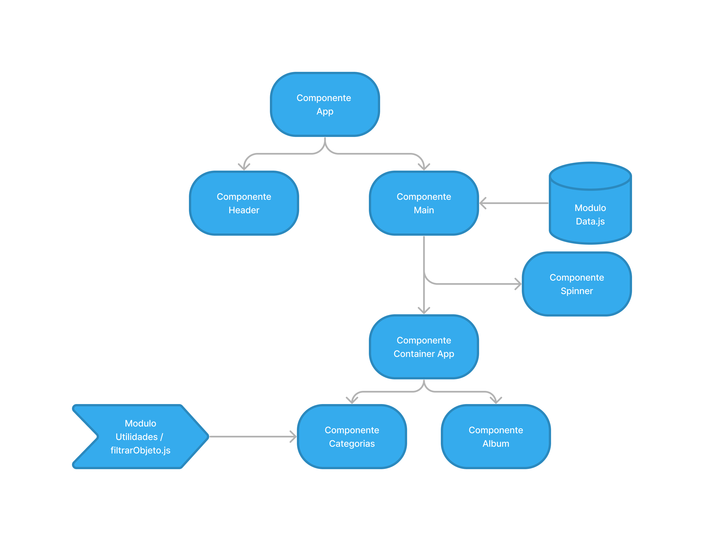
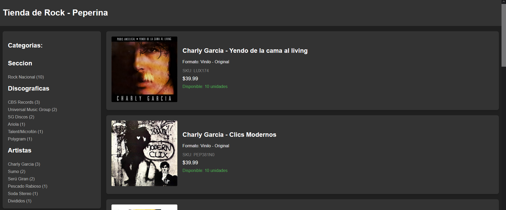
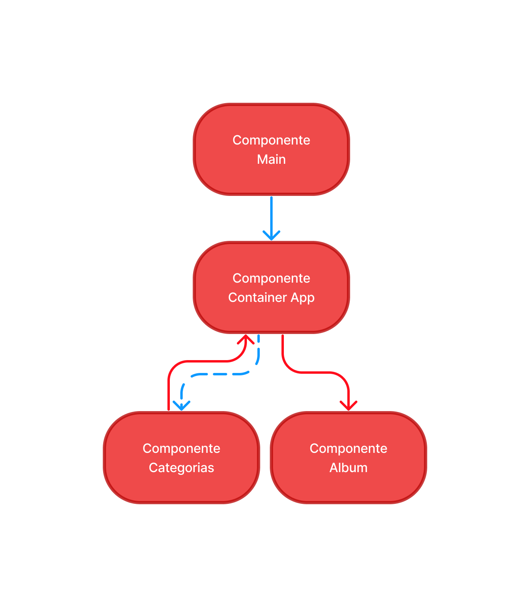

# Resolucion Ejercicio Clase 3

## Repositorio

- [https://github.com/JuanFPaz/tienda-de-musica](https://github.com/JuanFPaz/Tienda-de-Musica)

### Resolucion

Para la resolucion de este ejercicio, cree un [maquetado inicial](./maquetado-html/) con `HTML`, `CSS` y `JS` para luego pasarlo a `React.js`, un [JSON](https://raw.githubusercontent.com/JuanFPaz/Json/main/JSON-ejercicios/rock-nacional.json) para realizar un llamado con el api `Fetch()` y mostrar los productos, que en este caso son unos albumn de musica.

Para crear el JSON utilice [JSON Grid](https://jsongrid.com/json-grid) para formatear la estructura y minificar el `JSON`, y lo subi en un repositorio publico de `Github` para realizar un simple llamado `GET`.

La aplicacion final con `React.js` se encuentra en el directorio [tienda de musica](./tienda-de-musica/). Despues de haber realizado el maquetado inicial, comence a realizar la distribucion de los componentes y el flujo de los datos en la aplicacion:

#### Diagrama de componentes



1. El componente [App](./tienda-de-musica/src/App.jsx) se encarga de renderizar el `Header` y el `Main` de la aplicacion.

2. El Componente [Main](./tienda-de-musica/src/components/Main.jsx) se encarga de obtener los datos del modulo [data.js](./tienda-de-musica/src/data/data.js), almacenandolos en un estado utilizando `useState` y `useEffect`.

3. El uso de `useEffect` nos permite realizar llamados con `API Fetch`, y que en este caso solo se ejecutara cuando se renderize el componente `Main`. Generalmente se usa mientras se realiza una tarea asincrona (como en este caso el llamado con `fetch`), y mientras esperamos obtener los datos, el componente `Main` renderiza al componente [Spinner](./tienda-de-musica/src/components/ContainerApp/Spinner.jsx). Cuando `useEffect` termine de obtener los datos, cambiamos los estados de nuestra aplicacion y `Main` se va a encargar de mostrar el componente [Container App](./tienda-de-musica/src/components/ContainerApp/ContainerApp.jsx)

4. Ejemplo de `useEffect` en `Main`:

```jsx
import { useState, useEffect } from "react";
import Spinner from "./ContainerApp/Spinner";
import ContainerApp from "./ContainerApp/ContainerApp";
import data from "../data/data.js";

function Main() {
  //Creamos dos estados, un booleano y otro para almacenar los datos
  //Mientras el booleano sea "True", el componente main renderizara el Spinner
  //Cuando obtengamos los datos, lo almacenamos en el estado productos, y ademas cambiamos el estado cargando a "false"
  const [cargando, setCargando] = useState(true);
  const [productos, setProductos] = useState(null);
  useEffect(() => {
    data().then((data) => {
      setProductos(data.productos);
      setCargando(false);
    });
  }, []);
  return (
    <main>
      {cargando ? (
        <Spinner></Spinner>
      ) : (
        <ContainerApp productos={productos}></ContainerApp>
      )}
    </main>
  );
}
```

5. Una vez obtenido los datos, `ContainerApp` renderiza dos componentes que se muestran en el navegador, el componente [Categorias](./tienda-de-musica/src/components/ContainerApp/Categorias/Categorias.jsx) en el `Aside` de nuestra aplicacion, y el componente [Album](./tienda-de-musica/src/components/ContainerApp/Categorias/Album.jsx) en el `Section` de nuestra aplicacion. Este ultimo componente se encarga de mostrar los productos obtenidos.

6. Por ultimo, nuestro componente `Categorias`, utiliza el modulo [utilities/filtrarObjeto.js](./tienda-de-musica/src/utilities/filtrarObjeto.js) para hacer una ocurrencia de datos (una funcion que recorre en este caso una estructura de datos y obtiene una propiedad especifica y cuantas veces se repite) para crear una lista de categorias y poder filtrar los productos por diferentes datos.



#### Diagrama de flujo de datos



1. Como mencione anteriomente, el componente `Main` es el encargado de obtener los datos y almacenarlos en un estado llamado `Productos`. Este estado lo recibira nuestro componente `ContainerApp` cuando se renderize y creara una copia de `productos` para almacenarlo en un nuevo estado.

2. Los datos ahora toman dos caminos diferentes. El estado `productos` originales, lo recibe el componente `Catergorias`, para poder realizar el listado de `ocurrencias` mencionados anteriormente, filtrando del estado original las `discograficas` y `artistas`. Pero ademas de recibir el estado original, tambien recibe dos funciones para cambiar el estado de la copia de los productos, cuando se ejecuta el evento `onClick` en cada una de los items de la lista de ocurrencias.

3. Al componente `Album`, le enviamos la copia del estado `productos`. Lo que nos permite tener mayor flexibilidad, al momento de renderizar todo los productos al inicio, y que ademas, vamos a poder renderizar los productos filtrados en la lista de ocurrencias.
